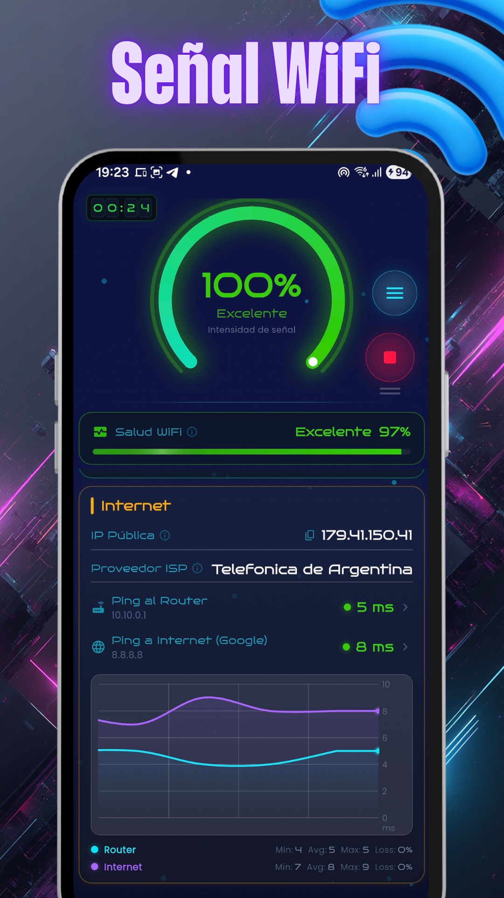
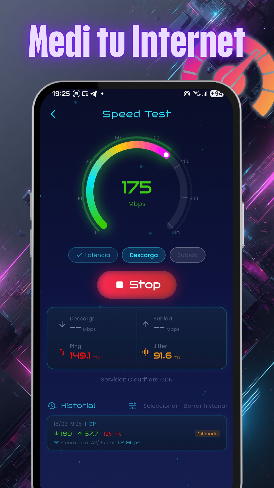
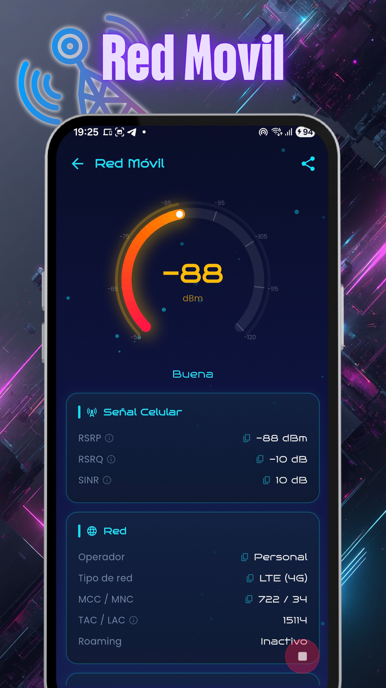
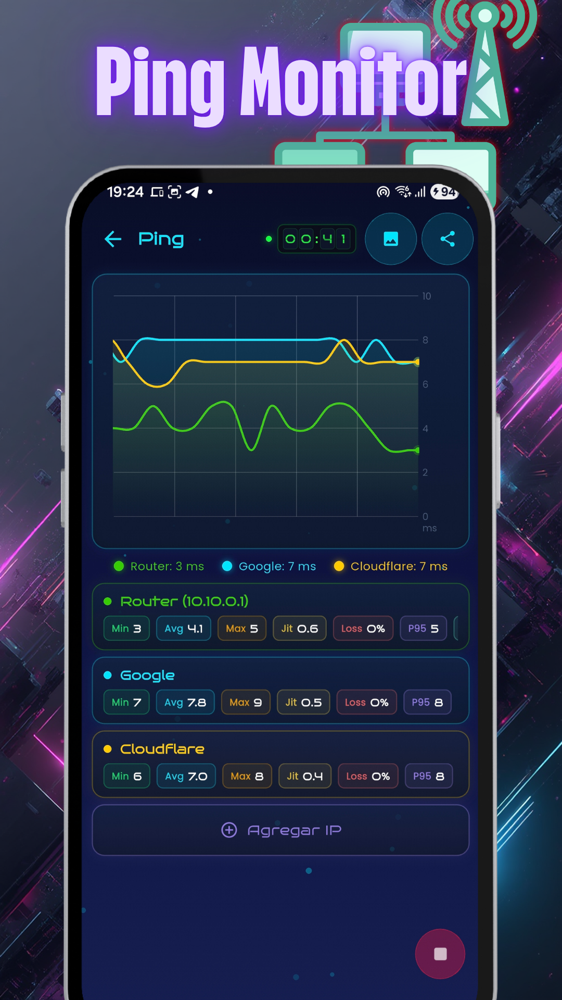
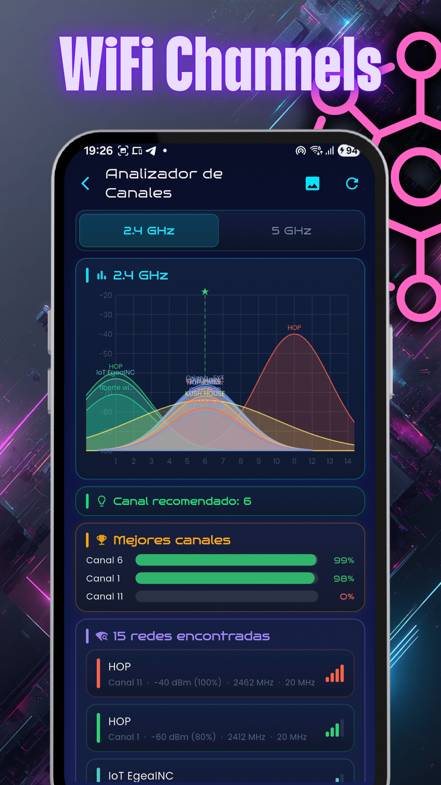
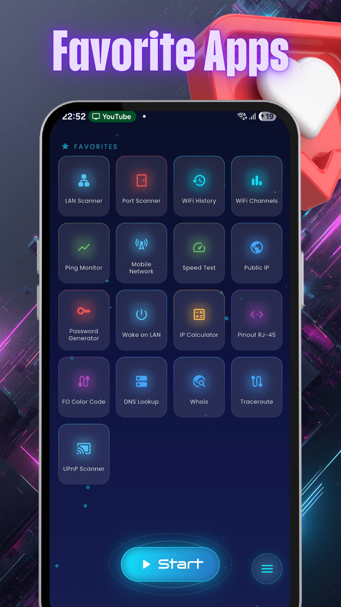
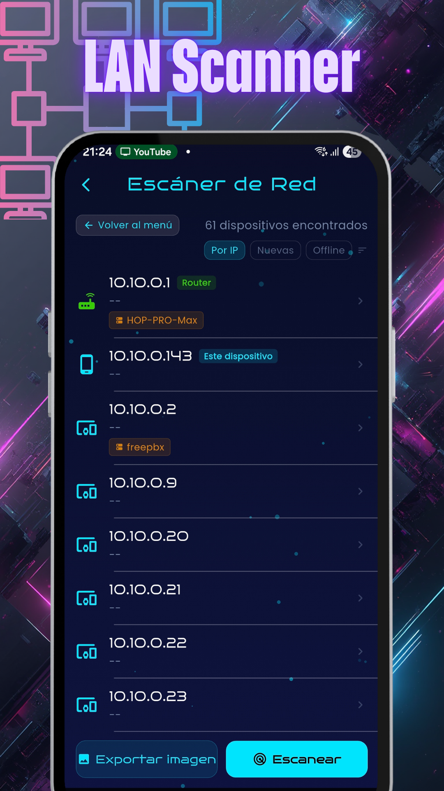
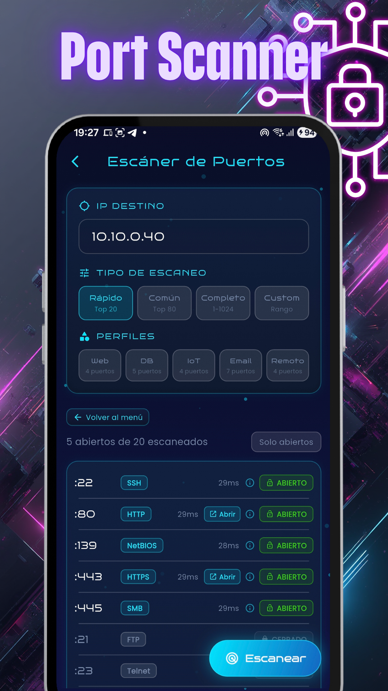

  <!-- Replace the URL below with the actual link to your logo -->
  
  <h1>EgeaINC WiFi Analyzer</h1>
  
<b>Your WiFi and Cellular Network, Under Absolute Control</b>

  
   
  

 

  <a href="README.md">🇦🇷 Español</a> | <b>🇺🇸 English</b>

 

Professional WiFi and cellular network analyzer, and IT tools suite. Designed for technicians, network administrators, gamers, and power users who need to diagnose, monitor, and optimize all their connections to the highest level.

Monitor your network in real-time with a modern and fluid **"glass" cyberpunk** interface. The Main Dashboard is a command center that shows you in a single view:
- **Global Status:** Real-time animated connection health gauge.
- **WiFi Network:** SSID, Signal Strength (dBm), Link Speed, Standard (e.g., WiFi 6 / 802.11ax), Security, and MAC Address (BSSID).
- **IP Metrics:** Local IP, Subnet Mask, and DNS Servers (1 and 2).
- **Routing:** Gateways (Router IP), Frequency (2.4 / 5 / 6 GHz), Channels, and animated historical graph with constant Ping to the Router.
- **Internet Outbound:** Your external Public IP, Provider (ISP), and persistent Ping to global servers (e.g., Google 8.8.8.8) measured directly on continuous charts.

---

## 🔥 NEW IN THIS VERSION (v0.74.1)

### Large text, nothing broken
- If your phone uses enlarged text, the app follows it up to **30% larger** and stops there. Before, with the largest setting, numbers spilled out of place and some text was cut off.
- Fixed what got cut off with large text in the Ping monitor, Public IP, the Color code, the Password generator, the Port scanner and the network list in the channel analyzer.

### In v0.74.0

#### Everything is free
- Everything that was Pro is now free: **Traceroute, DNS, Whois, Wake on LAN, UPnP**, tracking a network in first person, full histories, each device's vendor, export and share, neighbor cells and more. No locks, no limits.

#### Ads that stay out of the way
- In return, the app shows a **small banner** at the bottom of result, history and calculator screens. While a speed test or a scan is running, the banner hides.

#### Pro now removes the ads
- Pro is still the same **one-time purchase**, and now it lets you use the app without ads. If you are already Pro, you will not see any ads. Find it in the menu under "Remove ads".

#### Cell names, like in G-MoN
- Import a **.clf** file (the G-MoN format) in *Settings → Mobile network* and **Mobile Network** tells you which site you are on: the name shows in the Cell section, in the measurement history and in the report you share.
- It is looked up by operator and Cell ID. If your cell is not there but another one of the same eNB is, it shows that site and says so. The file stays on your phone.

### In v0.73.8
- **Track a network down to the device:** tap a network in the Channel analyzer and it opens in first person, with the signal in big numbers and whether you are getting closer or moving away.
- **Swipe between 2.4, 5 and 6 GHz** in the Channel analyzer (6 GHz if your phone sees WiFi 6E networks).
- **Fiber rack view** with pinch to zoom, landscape mode, buffer colors that follow the standard and trays from 8 to 48 fibers.
- **Smoother ping charts** that use less battery.
- Many fixes: the app no longer reports what it never measured, no lookup hangs, history keeps what happened and everything reads better with large text.

👉 **[View full changelog](CHANGELOG.md)**

---

## 📸 INTERFACE AND TOOLS

  
  
  
  

  
  
  
  

 

  <h3>🎥 Demo Video</h3>
  
   
  
<i>Click the image to watch the YouTube Short in action</i>

---

## 🛠️ INTEGRATED TOOL SUITE

### Connectivity and Diagnostics
- 📶 **WiFi Channels:** Analyzes congestion on 2.4, 5 and 6 GHz to find the optimal channel.
- 🎯 **Network Tracking:** Follow a network's signal in first person to find where the access point is.
- 📋 **WiFi History:** Logs your connections with signal and ISP data on expandable cards.
- 🔍 **LAN Scanner:** Discovers devices on your network with smart active/inactive detection.
- 🚪 **Port Scanner:** Detects open TCP ports and active services (HTTP, SSH, etc.).
- ⏱️ **Ping Monitor:** Measures latency in real-time with continuous scrolling graphs.
- 🚀 **Speed Test:** Multi-connection speed test via Cloudflare CDN with bottleneck indicators.
- 📱 **Mobile Network:** Deep analysis of cellular signal (RSRP, RSRQ, SINR, band, neighbor cells), with each cell's name from a CLF file (G-MoN format).
- 🌍 **Public IP:** Displays your external IP, your ISP and approximate location.
- 🛤️ **Traceroute:** The route hop by hop with its times, on a map and with comparison.
- 🔎 **DNS Lookup:** A, AAAA, MX, TXT, NS, CNAME and SOA records, with the server you choose.
- 🕵️ **Whois:** Domain registration data.
- ⚡ **Wake on LAN (WoL):** Turns on devices on your network remotely.
- 🔌 **UPnP Scanner:** Discovers devices with UPnP enabled.

### Cabling and Fiber Optics
- 🔌 **RJ-45 Pinout:** Visual guide for wiring UTP cables (T-568A/B).
- 🎨 **FO Color Code:** Interactive viewer for TIA-598-C and SIECOR standards, with a rack view.
- 📉 **Fiber dB Calculator:** Calculates expected attenuation for a fiber optic link based on fiber type, wavelength, distance, splices, connectors, and margin. Compare against real measurements (PASS/FAIL) and includes a dBm↔mW converter.

### Utilities and References
- 🔑 **Password Generator:** Creates secure passwords and checks for breaches without ever sending the password.
- 🧮 **IP Calculator:** Calculates subnets, ranges, and CIDR masks.

---

## 💎 FREE, AND PRO WITHOUT ADS

Every tool is free, with no limits. The app is supported by discreet ads.

If you'd rather not see ads, **EgeaINC Pro** removes them for good with a one-time payment.

---

## 📱 HIGHLIGHTED FEATURES

- ✔️ **"Glass" dark design:** Optimized for OLED screens.
- ✔️ **Bilingual Interface:** Available in Spanish and English.
- ✔️ **Educational Glossary:** Tap any metric to learn technical concepts.
- ✔️ **Your data on your phone:** Measurements and history stay on your phone, with no account and no EgeaINC server. See the [privacy policy](PRIVACY_POLICY.md).

---

## 💬 Feedback and Support

This repository is strictly intended for the community to provide **feedback, report bugs, and suggest new features** for EgeaINC WiFi Analyzer. 

If you found a bug or have a great idea for the app:
👉 **[Open a new Issue here](https://github.com/gabriel600r/wifi-analyzer-feedback/issues)**

Thank you for helping us improve!
