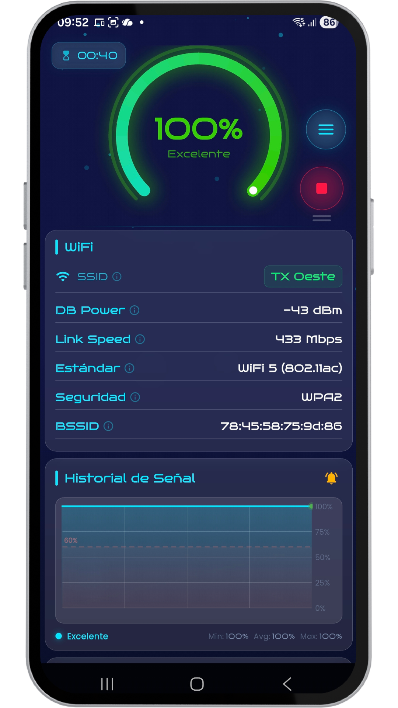
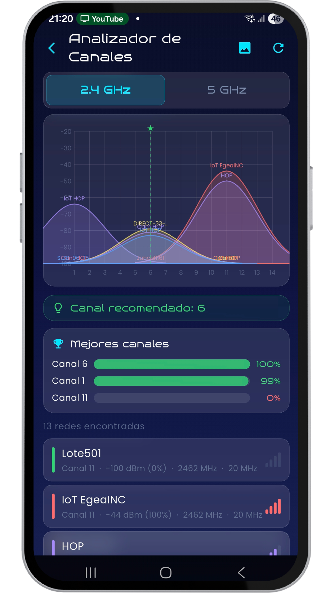
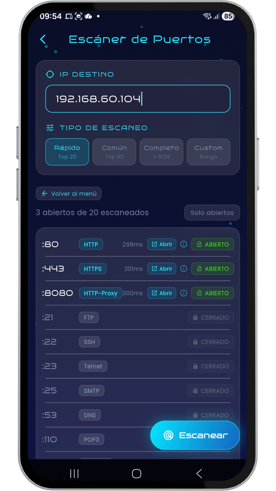
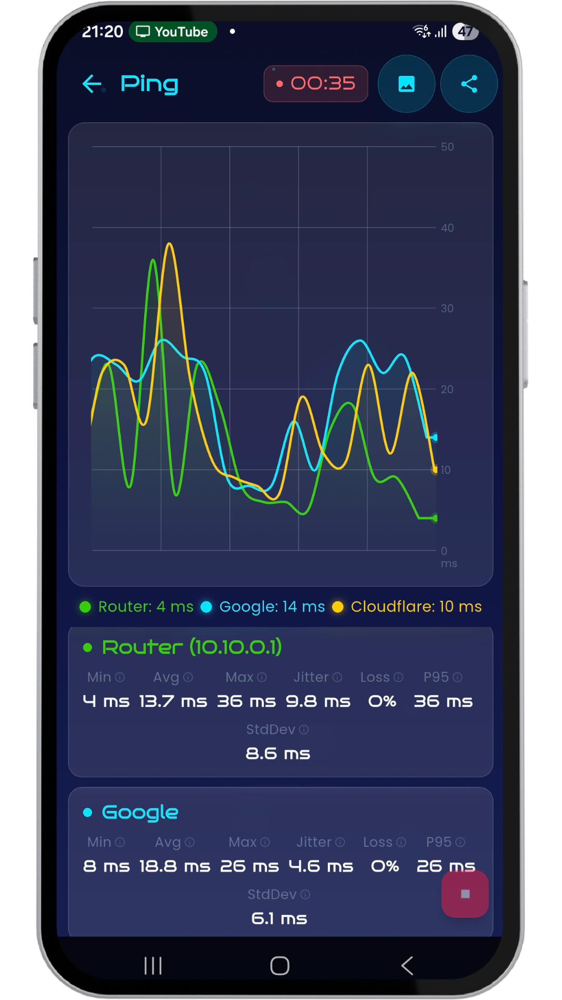
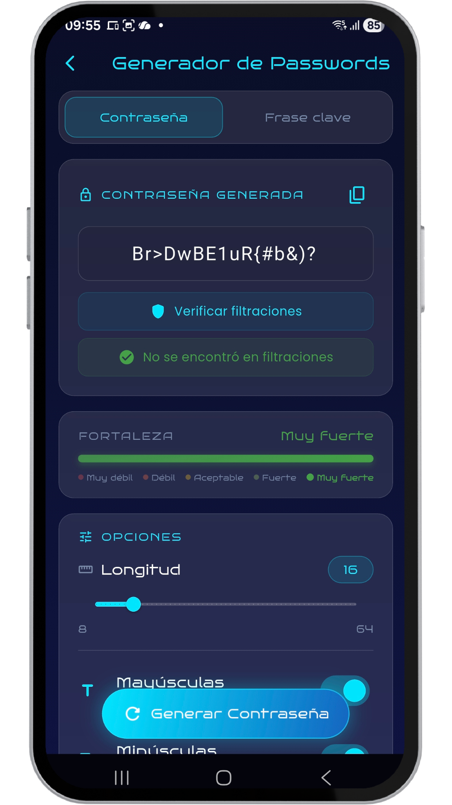
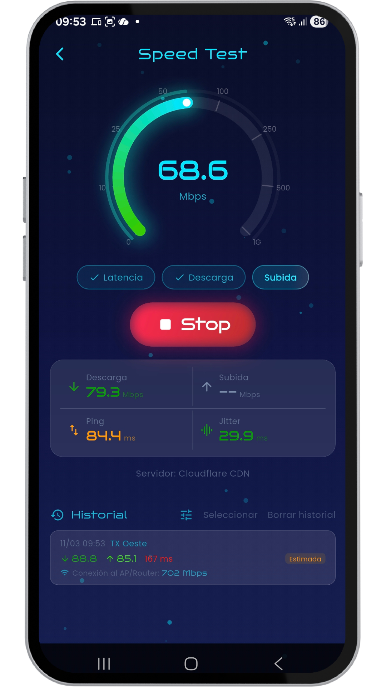
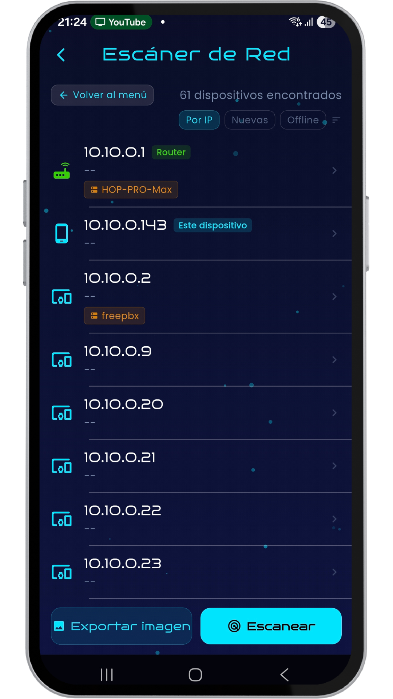
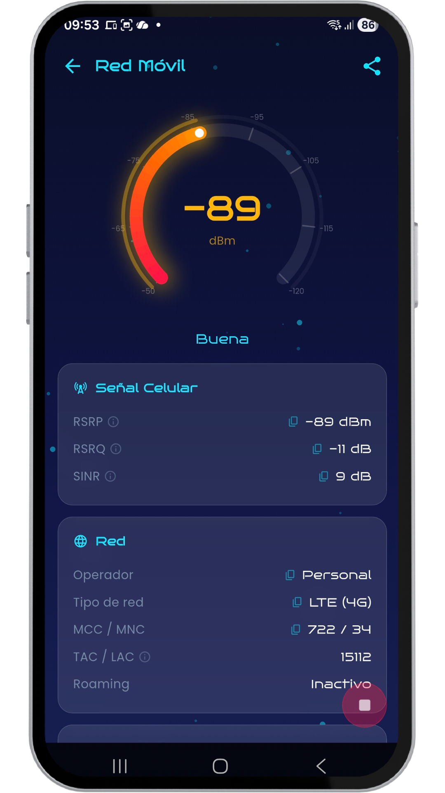

  <!-- Reemplaza la URL de abajo con el enlace real a tu logo -->
  
  <h1>EgeaINC WiFi Analyzer</h1>
  
<b>Tu Red WiFi y Móvil, Bajo Control Absoluto</b>

  
  

 

Analizador profesional de WiFi, redes celulares y suite de herramientas IT. Diseñado para técnicos, administradores de red, gamers y usuarios avanzados que necesitan diagnosticar, monitorear y optimizar todas sus conexiones al máximo nivel.

Monitorea tu red en tiempo real con una interfaz moderna y fluida estilo **cyberpunk "glass"**. Visualiza la intensidad de señal, estándares WiFi, parámetros celulares (RSRP, SINR), IP, DNS y mucho más, todo en un solo lugar.

---

## 🔥 NUEVO EN ESTA VERSIÓN: ANÁLISIS CELULAR Y MÁS

- **Analizador de Red Móvil:** Nueva herramienta para diagnosticar tu conexión celular en tiempo real (RSRP, RSRQ, SINR, datos de celda, banda y roaming).
- **Interfaz Cyberpunk Mejorada:** Animación de revelado en el gauge de señal, timer flotante arrastrable (FAB), botón Start/Stop modernizado y gradientes premium.
- **Estándar SIECOR:** Integrado al visor de códigos de colores FO.
- **Mejoras y Correcciones:** Radar LAN mejorado, escáneres inteligentes con detección en tiempo real (etiquetas para dispositivos nuevos/offline), historial de Speed Test ampliado y el Ping Monitor ahora verifica GPS/WiFi antes de iniciar.

---

## 📸 INTERFAZ Y HERRAMIENTAS

  
  
  
  

  
  
  
  

---

## 🛠️ SUITE DE HERRAMIENTAS INTEGRADA

### Conectividad y Diagnóstico
- 📶 **Canales WiFi:** Analiza la congestión en 2.4GHz y 5GHz para encontrar el canal óptimo.
- 📋 **Historial WiFi:** Registra tus conexiones con datos de señal e ISP y tarjetas expandibles.
- 🔍 **Escáner LAN:** Descubre dispositivos en tu red con detección inteligente de altas/bajas.
- 🚪 **Escáner Puertos:** Detecta puertos TCP abiertos y servicios activos (HTTP, SSH, etc.).
- ⏱️ **Monitor Ping:** Mide la latencia en tiempo real con gráficas de scroll continuo.
- 🚀 **Speed Test:** Prueba de velocidad multi-conexión vía Cloudflare CDN con indicadores de cuello de botella.
- 📱 **Red Móvil:** Análisis profundo de señal celular.
- 🌍 **IP Pública:** Muestra tu IP externa y tu ISP.

### Utilidades y Referencias
- 🔑 **Generador Passwords:** Crea claves ultra seguras y personalizables.
- 🧮 **Calculadora IP:** Calcula subredes, rangos y máscaras CIDR.
- 🔌 **Pinout RJ-45:** Guía visual de armado de cables UTP (T-568A/B).
- 🎨 **Código Color FO:** Visor interactivo de estándares TIA-598-C y SIECOR.

---

## 💎 EGEAINC PRO (Premium)

Desbloquea las herramientas avanzadas y elimina todos los límites:

- 🔎 **DNS Lookup:** Consulta registros DNS (A, MX, TXT, NS, etc.).
- 🕵️ **Whois:** Obtén información detallada de registro y titularidad de dominios.
- 🛤️ **Traceroute:** Rastrea la ruta y mide los tiempos de salto de los paquetes en la red.
- ⚡ **Wake on LAN (WoL):** Enciende equipos de tu red de forma remota.
- 🔌 **Escáner UPnP:** Descubre dispositivos con Universal Plug and Play activo.
- ➕ **Funciones Pro adicionales:** Detección de celdas vecinas (Red Móvil), historial extendido (Speed Test) y filtros avanzados.

---

## 📱 CARACTERÍSTICAS DESTACADAS

- ✔️ **Diseño oscuro "glass":** Optimizado para pantallas OLED.
- ✔️ **Interfaz bilingüe:** Disponible en Español e Inglés.
- ✔️ **Glosario Educativo:** Toca cualquier métrica para aprender conceptos técnicos.
- ✔️ **Privacidad Garantizada:** Experiencia limpia, segura y sin rastreo oculto.

---

## 💬 Feedback y Soporte

Este repositorio está destinado exclusivamente a la comunidad para brindar **feedback, reportar errores y sugerir nuevas mejoras** de EgeaINC WiFi Analyzer. 

Si encontraste un bug o tienes una gran idea para la app:
👉 **[Abre un nuevo Issue aquí](https://github.com/gabriel600r/wifi-analyzer-feedback/issues)**

¡Gracias por ayudarnos a mejorar!
